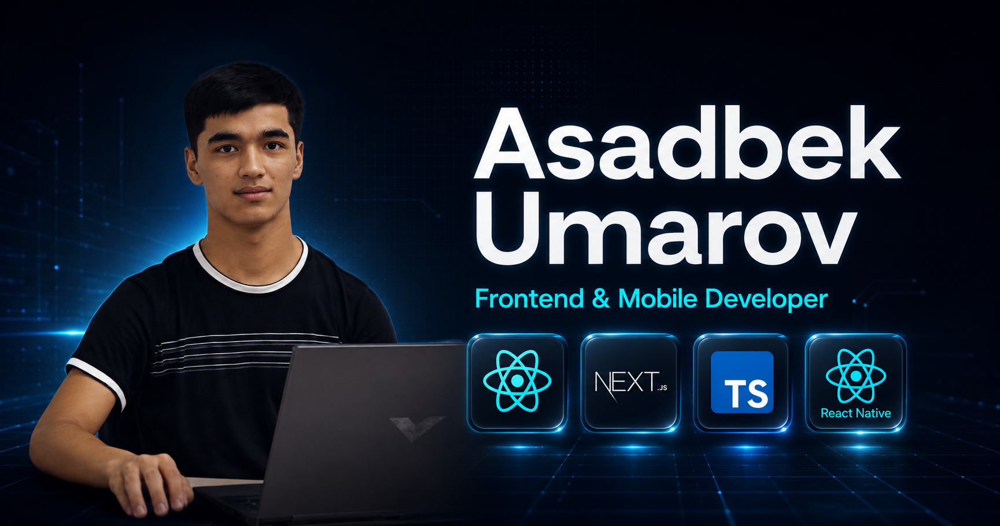

# Asadbek Umarov — Portfolio

Bu loyiha Asadbek Umarovning (Frontend & Mobile dasturchi) shaxsiy portfolio veb-saytidir. Loyiha orqali dasturchining tajribasi, ko'nikmalari (React, Next.js, React Native, Vue, Nuxt) va bajargan ishlari bilan tanishish mumkin.

## 🔗 Live Demo
Jonli loyihani ko'rish uchun bu yerga bosing: **[portfolio-umarov-asadbek.vercel.app](https://portfolio-umarov-asadbek.vercel.app)**

## 📸 Skrinshot


## 🛠 Ishlatilgan Texnologiyalar
- **[Nuxt 3](https://nuxt.com/)** — Asosiy freymvork (Vue 3 Composition API asosida).
- **[TypeScript](https://www.typescriptlang.org/)** — Statik tiplar va xavfsiz kod yozish uchun.
- **[Tailwind CSS](https://tailwindcss.com/)** — Zamonaviy va moslashuvchan (responsive) UI dizayn uchun.
- **[@nuxtjs/i18n](https://v8.i18n.nuxtjs.org/)** — Ko'p tillilik (O'zbek va Ingliz tillari) uchun.
- **[nuxt-schema-org](https://nuxtseo.com/schema-org/)** — Qidiruv tizimlari optimizatsiyasi (SEO) uchun JSON-LD.

## 🚀 Local'da Ishga Tushirish (Development)

Loyihani o'z kompyuteringizda ishga tushirish uchun quyidagi qadamlarni bajaring:

1. **Repozitoriyni yuklab oling:**
   ```bash
   git clone <repo-url>
   cd portfolio
   ```

2. **Kutubxonalarni o'rnating:**
   ```bash
   npm install
   ```

3. **Loyihani ishga tushiring:**
   ```bash
   npm run dev
   ```

Loyiha lokal serverda odatda `http://localhost:3000` manzilida ochiladi.
